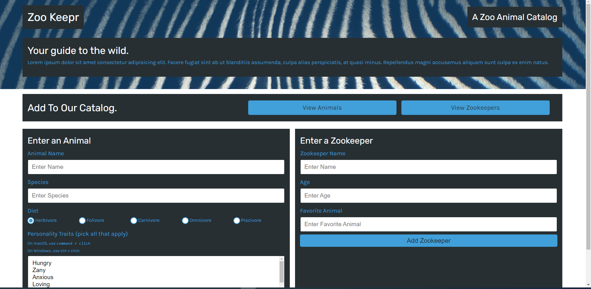

# zookeepr

- Github URL: https://github.com/DanielCConlon/u-develop-it
- Heroku URL: updating heroku deployment
<!-- https://lit-sierra-88684.herokuapp.com/ -->

## Table-of-Contents

- [Description](#description)
- [Usage](#usage)
- [Application](#application)

## [Description](#description)

This application is called zoo-keepr deployed through heroku following steps from a course module. Utilizing Express.js and a front end already created.

## [Usage](#table-of-contents)

Open the website and enter an animal or zookeepers. You can view all the animals or zookeepers by clicking the buttons.

## [Application](#table-of-contents)

